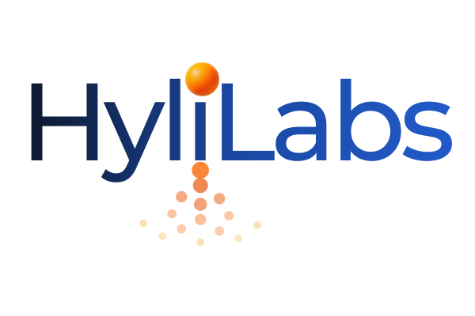
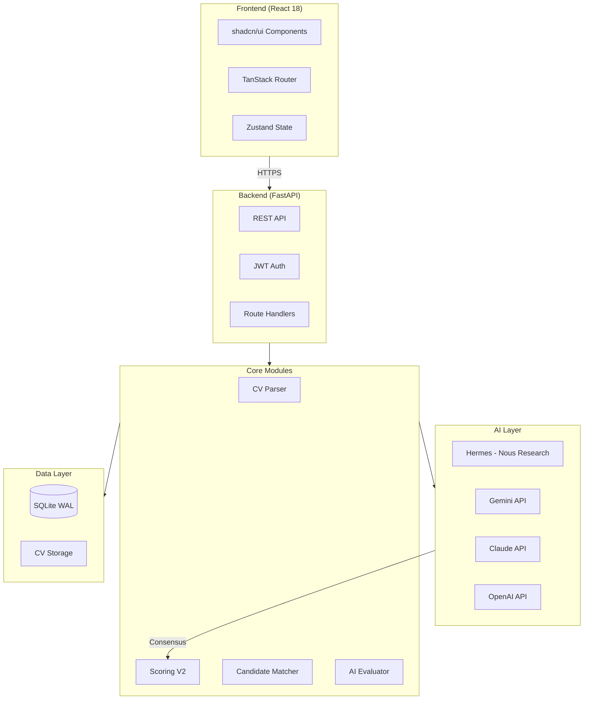

<div align="center">



# HyliLabs

**AI-Powered HR Recruitment Platform**

[](LICENSE)
[](https://python.org)
[](https://reactjs.org)
[](https://fastapi.tiangolo.com)
[](#-scoring-system)
[](#)
[](#-security)

[Demo](https://hylilabs.com) • [Documentation](#-documentation) • [Contributing](CONTRIBUTING.md)

</div>

---

## Quick Links

| [Overview](#-overview) | [Why HyliLabs?](#-why-hylilabs) | [Tech Stack](#-tech-stack) | [Installation](#-installation) | [Architecture](#-architecture) | [Scoring System](#-scoring-system) | [Roadmap](#-roadmap) |
|---|---|---|---|---|---|---|

---

## Overview

HyliLabs is an enterprise-grade AI-powered recruitment platform designed for the Turkish market. It combines multiple AI models (Hermes by Nous Research, Gemini, Claude, OpenAI) for intelligent CV analysis, candidate matching, and hiring decisions.

### Powered By

<p align="center">
  
  
  
  
</p>

### AI Models

| Model | Provider | Usage | Fallback Order |
|-------|----------|-------|----------------|
| **Hermes** | Nous Research | V3 Scoring (Primary) | 1 |
| **Gemini 2.5 Flash** | Google | CV Intelligence, V3 Scoring | 2 |
| **Claude** | Anthropic | CV Parsing, V3 Scoring | 3 |
| **GPT-4** | OpenAI | V3 Scoring | 4 |

---

## Why HyliLabs?

Traditional ATS systems fail at understanding Turkish CVs, construction terminology, and local market nuances. HyliLabs was built from the ground up for Turkish HR teams.

| Problem | Traditional ATS | HyliLabs Solution |
|---------|-----------------|-------------------|
| Turkish CV parsing | Fails on Turkce characters | Native TR support with correct encoding |
| Construction sector | Generic keyword matching | 150+ construction terms, certificate tracking |
| Candidate scoring | Single model, biased results | 4-model consensus (Hermes + Gemini + Claude + GPT) |
| KVKK compliance | Bolt-on, incomplete | Built-in audit trail, consent management |
| Synonym handling | None or basic | 387+ synonyms with ML-based confidence |
| Location matching | City-level only | Istanbul 38-ilce aware, neighborhood matching |

---

### Key Features

- **Multi-AI Scoring System** - Consensus-based evaluation using 4 AI models
- **Intelligent CV Parsing** - Automatic extraction of skills, experience, and education
- **Smart Matching** - 100-point scoring system with weighted categories
- **Industry Intelligence** - Specialized support for construction sector
- **Interview Management** - Scheduling, reminders, and KVKK-compliant confirmations
- **KVKK Compliance** - Full Turkish data protection law compliance
- **Multi-tenant Architecture** - Company-level data isolation

---

## Tech Stack

### Backend
- **Framework:** FastAPI (Python 3.11+)
- **Database:** SQLite with WAL mode
- **AI Models:** Hermes (Nous Research), Gemini (Google), Claude (Anthropic), GPT (OpenAI)
- **Authentication:** JWT with role-based access control

### Frontend
- **Framework:** React 18 + TypeScript
- **UI Library:** shadcn/ui + Tailwind CSS
- **Routing:** TanStack Router
- **Build Tool:** Vite

### Infrastructure
- **Deployment:** PM2 + Nginx
- **SSL:** Let's Encrypt (Certbot)
- **Server:** Ubuntu 22.04 LTS

---

## Installation

### Prerequisites

- Python 3.11+
- Node.js 18+
- pnpm or npm

### Quick Start

1. **Clone the repository**
```bash
git clone https://github.com/osmanemraheroglu/hylilabs.git
cd hylilabs
```

2. **Backend Setup**
```bash
cd api
python -m venv venv
source venv/bin/activate  # Windows: venv\Scripts\activate
pip install -r requirements.txt
cp .env.example .env
# Edit .env with your API keys
```

3. **Frontend Setup**
```bash
cd ..  # Back to root
pnpm install
cp .env.example .env
# Edit .env with your settings
```

4. **Start Development Servers**
```bash
# Terminal 1 - Backend
cd api && uvicorn main:app --reload --port 8000

# Terminal 2 - Frontend
pnpm dev
```

5. **Access the application**
- Frontend: http://localhost:5173
- API Docs: http://localhost:8000/docs

---

## Architecture

### System Overview



### Directory Structure

```
hylilabs/
├── api/                    # FastAPI Backend
│   ├── core/              # Core modules (scoring, CV parsing, matching)
│   │   ├── scoring_v2.py  # 100-point scoring system
│   │   ├── scoring_v3/    # AI-based evaluation
│   │   ├── cv_parser.py   # CV parsing with Claude
│   │   └── candidate_matcher.py
│   ├── routes/            # API endpoints
│   ├── database.py        # SQLite operations
│   └── main.py            # FastAPI app
├── src/                   # React Frontend
│   ├── features/          # Feature modules
│   ├── components/        # Shared components
│   └── routes/            # TanStack Router
├── data/                  # Database & CV storage
└── docs/                  # Documentation
```

---

## Scoring System

HyliLabs uses a hybrid scoring approach combining deterministic rules (V2) with AI consensus (V3).

### Scoring Flow

```
┌─────────────────────────────────────────────────────────────────┐
│                        CV UPLOADED                               │
└─────────────────────────────────────────────────────────────────┘
                              │
                              ▼
┌─────────────────────────────────────────────────────────────────┐
│                    CV PARSER (Claude)                            │
│  Extract: Skills, Experience, Education, Location, Certificates │
└─────────────────────────────────────────────────────────────────┘
                              │
              ┌───────────────┴───────────────┐
              ▼                               ▼
┌──────────────────────────┐    ┌──────────────────────────┐
│     V2 SCORING (40%)     │    │     V3 SCORING (60%)     │
│  Deterministic Rules     │    │    AI Consensus          │
│                          │    │                          │
│  Position Match:   20    │    │  ┌─────────┐             │
│  Technical Skills: 40    │    │  │ Hermes  │──┐          │
│  General:          15    │    │  └─────────┘  │          │
│  Task Match:       15    │    │  ┌─────────┐  │ Weighted │
│  Elimination:      10    │    │  │ Gemini  │──┤ Average  │
│  ─────────────────────   │    │  └─────────┘  │          │
│  TOTAL:           100    │    │  ┌─────────┐  │          │
│                          │    │  │ Claude  │──┤          │
└──────────────────────────┘    │  └─────────┘  │          │
              │                 │  ┌─────────┐  │          │
              │                 │  │  GPT-4  │──┘          │
              │                 │  └─────────┘             │
              │                 └──────────────────────────┘
              │                               │
              └───────────────┬───────────────┘
                              ▼
┌─────────────────────────────────────────────────────────────────┐
│              FINAL SCORE = (V3 × 0.60) + (V2 × 0.40)            │
└─────────────────────────────────────────────────────────────────┘
```

### V2 Scoring (Deterministic) - 100 Points

| Category | Max Points | Details |
|----------|------------|---------|
| Position Match | 20 | Title (8) + Sector (7) + Seniority (5) |
| Technical Skills | 40 | Must-have (15) + Critical (15) + Important (10) |
| General | 15 | Experience (8) + Education (7) |
| Task Match | 15 | Job description alignment |
| Elimination | 10 | Location (5) + Other (5) |

### V3 Scoring (AI-Based)

- Multi-model consensus (Hermes, Gemini, Claude, OpenAI)
- Each model evaluates independently
- Fallback chain: If primary model fails, next model takes over
- Final score: Weighted average with outlier detection

---

## Security

- **API Keys**: Stored in `.env` files, never committed to repository
- **KVKK Compliance**: Full Turkish data protection law compliance
- **Multi-tenant Isolation**: Company-level data separation
- **JWT Authentication**: Secure token-based authentication
- **Rate Limiting**: API endpoint protection

---

## Roadmap

| Feature | Status |
|---------|--------|
| Multi-AI Scoring System | Complete |
| CV Intelligence | Complete |
| Construction Industry Intelligence | Complete |
| Dashboard Analytics | Complete |
| Fallback Chain System | Complete |
| Career Page | Coming Soon |
| Public API | Coming Soon |
| Mobile App | Planned |

---

## Contributing

Contributions are welcome! Please read [CONTRIBUTING.md](CONTRIBUTING.md) for guidelines.

1. Fork the repository
2. Create your feature branch (`git checkout -b feature/amazing-feature`)
3. Commit your changes (`git commit -m 'Add amazing feature'`)
4. Push to the branch (`git push origin feature/amazing-feature`)
5. Open a Pull Request

---

## License

This project is licensed under the MIT License - see the [LICENSE](LICENSE) file for details.

---

## Acknowledgments

- [Nous Research](https://nousresearch.com) for Hermes model — **Primary AI Engine**
- [Google](https://ai.google.dev) for Gemini API
- [Anthropic](https://anthropic.com) for Claude API
- [OpenAI](https://openai.com) for GPT API

---

<div align="center">

Built with care by [@osmanemraheroglu](https://github.com/osmanemraheroglu)

**[HyliLabs](https://hylilabs.com)** — Smarter Hiring, Powered by AI

</div>
